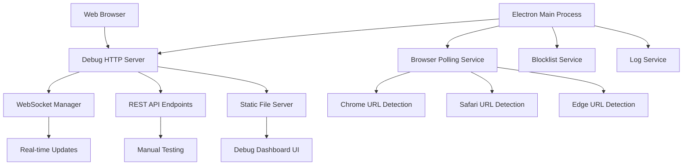

# Design Document

## Overview

The browser debug interface will be implemented as an HTTP server within the Electron main process that serves a real-time debugging dashboard. This approach allows developers to access comprehensive debugging information through any web browser without interfering with the main application functionality. The debug server will use WebSocket connections for real-time updates and provide a REST API for manual testing capabilities.

## Architecture

### High-Level Architecture



### Component Integration

The debug server will integrate with existing application components:
- **Main Process**: Hosts the debug server and coordinates all services
- **Browser Polling**: Enhanced to emit events for debug monitoring
- **Blocklist Service**: Enhanced to broadcast updates to debug clients
- **Log Service**: Enhanced to stream logs to debug interface
- **Kill Process**: Enhanced to notify debug clients of actions

## Components and Interfaces

### Debug Server Component

**Purpose**: HTTP server that serves the debugging interface and provides real-time data

**Key Classes**:
- `DebugServer`: Main server class managing HTTP and WebSocket connections
- `WebSocketManager`: Handles real-time communication with debug clients
- `DebugAPIRouter`: Handles REST API endpoints for manual testing

**Interfaces**:
```typescript
interface DebugServerConfig {
  port: number;
  host: string;
  enabled: boolean;
}

interface DebugClient {
  id: string;
  socket: WebSocket;
  connectedAt: Date;
}

interface DebugEvent {
  type: 'blocklist-update' | 'url-check' | 'domain-blocked' | 'browser-killed' | 'log-entry';
  timestamp: Date;
  data: any;
}
```

### Real-time Data Streaming

**Purpose**: Broadcast application events to connected debug clients

**Key Features**:
- WebSocket connections for low-latency updates
- Event filtering and throttling to prevent overwhelming clients
- Connection management with automatic reconnection support

**Event Types**:
- Blocklist updates from remote API
- Browser URL polling results
- Domain blocking events
- Browser process termination events
- Application log entries
- System status changes

### Debug Dashboard UI

**Purpose**: Web-based interface for viewing debug information

**Key Sections**:
1. **System Status**: Application version, platform, permissions, server info
2. **Current Rules**: Active blocklist with time period highlighting
3. **Browser Monitor**: Real-time browser URLs and status
4. **Event Log**: Chronological list of blocking events and actions
5. **Application Logs**: Recent log entries with filtering
6. **Manual Testing**: Tools for testing URL blocking logic

**Technology Stack**:
- Vanilla HTML/CSS/JavaScript (no build process required)
- WebSocket client for real-time updates
- Responsive design for various screen sizes

### Enhanced Application Services

**Browser Polling Enhancement**:
```typescript
interface BrowserStatus {
  browser: 'chrome' | 'edge' | 'safari';
  isRunning: boolean;
  currentUrl: string | null;
  lastChecked: Date;
}
```

**Blocklist Service Enhancement**:
```typescript
interface BlocklistStatus {
  lastUpdated: Date;
  nextUpdate: Date;
  updateInterval: number;
  isActive: boolean;
  currentPeriod: BlockPeriod | null;
}
```

## Data Models

### Debug State Model

```typescript
interface DebugState {
  systemInfo: {
    platform: string;
    version: string;
    accessibilityEnabled: boolean;
    logPath: string;
  };
  blocklist: {
    data: BlockListResponse;
    status: BlocklistStatus;
    error: string | null;
  };
  browsers: {
    [key in 'chrome' | 'edge' | 'safari']: BrowserStatus;
  };
  recentEvents: DebugEvent[];
  recentLogs: LogEntry[];
  clients: DebugClient[];
}
```

### Event History Model

```typescript
interface LogEntry {
  timestamp: Date;
  level: 'info' | 'warn' | 'error';
  message: string;
  source: string;
}

interface BlockingEvent {
  timestamp: Date;
  url: string;
  domain: string;
  matchedRule: BlockPeriod;
  browser: string;
  action: 'warned' | 'killed';
}
```

## Error Handling

### Server Startup Errors
- Port conflicts: Automatically try next available port (3001-3010 range)
- Permission errors: Log error and disable debug server gracefully
- Network errors: Retry with exponential backoff

### Runtime Errors
- WebSocket connection failures: Log and clean up client connections
- API endpoint errors: Return appropriate HTTP status codes with error details
- Data serialization errors: Log error and return safe fallback data

### Client-Side Error Handling
- WebSocket disconnections: Automatic reconnection with exponential backoff
- API request failures: Display error messages with retry options
- Data parsing errors: Show error state with diagnostic information

## Testing Strategy

### Unit Testing
- Debug server initialization and configuration
- WebSocket connection management
- API endpoint functionality
- Event broadcasting logic
- Data serialization/deserialization

### Integration Testing
- Debug server integration with main application
- Real-time event streaming accuracy
- Browser polling integration
- Blocklist service integration
- Log service integration

### Manual Testing
- Debug dashboard UI functionality across different browsers
- Real-time updates during normal application operation
- Manual testing tools accuracy
- Error handling and recovery scenarios
- Performance under various load conditions

### End-to-End Testing
- Complete debug workflow from server startup to client interaction
- Multi-client connection handling
- Long-running session stability
- Debug server shutdown and cleanup

## Security Considerations

### Access Control
- Debug server only accessible from localhost by default
- Optional configuration for network access with warnings
- No authentication required for localhost access (development use)

### Data Exposure
- Debug interface exposes application internals (acceptable for development)
- No sensitive user data exposed (URLs are operational data)
- Admin password not exposed in debug interface

### Resource Protection
- Connection limits to prevent resource exhaustion
- Event throttling to prevent memory issues
- Automatic cleanup of old events and logs