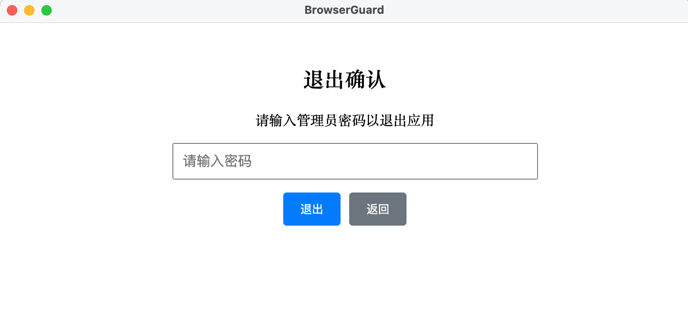

# BrowserGuard

## 项目简介
BrowserGuard 是一款专为家庭电脑学习管理设计的智能浏览器监控工具。通过实时监控浏览器访问行为，自动拦截游戏网站、短视频平台等娱乐内容，帮助孩子建立健康的上网习惯，实现防沉迷管理。
> 

## 安装与运行

> **快速体验**：如果你只想直接使用，无需源码编译，可前往 [Releases 页面](https://github.com/ltanme/BrowserGuard/releases) 下载适合你系统的安装包（支持 macOS 和 Windows），安装后即可运行。

1. `git clone` 本仓库，`cd BrowserGuard`
2. `npm install`
3. 开发模式：`npm run dev`
4. 打包：使用 `./build.sh` 脚本

## 打包脚本使用

### 快速打包
```bash
# 打包所有平台 (macOS + Windows)
./build.sh

# 只打包 macOS
./build.sh --mac

# 只打包 Windows
./build.sh --win

# 只清理缓存
./build.sh --clean-only

# 查看帮助
./build.sh --help
```

### 手动打包 (旧方式)
```bash
# macOS (Apple Silicon)
npm run build:mac

# Windows 10 x86
npm run build:win
```

## 首次运行 & 权限授予

- macOS 首次启动会自动弹出"辅助功能"设置面板，请勾选 BrowserGuard。
- Windows 需以管理员身份运行以便自动关闭浏览器进程。

## 功能说明

### 核心功能
- 开机自启（macOS LaunchAgent/Windows 注册表）
- 轮询 blocklist 接口，实时拦截受限域名
- 支持 Chrome/Safari/Edge/Firefox
- 多语言弹窗（中/英）
- 日志写入 `~/Library/Logs/BrowserGuard/renderer.log` 或 `%APPDATA%\BrowserGuard\logs\renderer.log`
- 仅管理员密码可退出

### 新增功能
- **首次运行设置**：初次启动时自动引导用户设置管理员密码和规则接口
- **本地配置管理**：密码和配置信息保存在本地，支持修改
- **自动规则重载**：可配置的自动重载间隔，新规则自动生效
- **跨平台支持**：Windows 和 macOS 分别处理配置文件路径
- **Dashboard界面**：显示当前规则、配置信息和重载状态

### 默认配置
- 管理员密码：`123456`
- 规则接口：`https://api.example.com/blocklist`
- 自动重载间隔：30秒
- 配置文件位置：
  - macOS: `~/Library/Application Support/BrowserGuard/config.json`
  - Windows: `%APPDATA%\BrowserGuard\config.json`

### 拦截规则说明（blocklist.json）

- 应用会定时从配置的规则接口（或本地文件）拉取拦截规则，规则格式为 JSON，示例见 `blocklist.json`。
- 每条规则可指定生效时间段（start/end）和对应的受限域名列表（domains）。
- 支持多个时间段和不同的域名组合，便于灵活配置学习/娱乐时段。

#### blocklist.json 示例
- https://raw.githubusercontent.com/ltanme/BrowserGuard/refs/heads/master/blocklist.json
```json
{
  "periods": [
    {
      "start": "08:00",
      "end": "12:00",
      "domains": [
        "poki.com",
        "4399.com"
        ]
    }
}
```


## 界面预览

### 1. 管理员登录界面
> **说明**：首次启动或每次登录时，用户需输入管理员密码才能进入主界面。
>
> 

### 2. Dashboard 主界面 - 规则展示
> **说明**：登录后显示当前规则、拦截时间段、受限域名等信息，并可进入配置设置。
>
> 

### 3. 规则配置窗口
> **说明**：可修改管理员密码、规则接口、自动重载间隔、调试模式等，支持热更新。
>
> 
> 

### 4. 检测到游戏网站自动关闭浏览器
> **说明**：仅支持火狐,safari,chrome,edge等主流浏览器。
>
> 

### 4. 退出确认窗口
> **说明**：点击退出时需再次输入管理员密码确认，防止误操作。
>
> 

## 使用说明

### 首次运行
1. 启动应用后会自动显示首次运行设置界面
2. 设置管理员密码（默认为123456）
3. 配置规则接口URL
4. 设置自动重载间隔（10-300秒）
5. 点击"完成设置"进入主界面

### 日常使用
1. 启动应用后输入管理员密码登录
2. 在Dashboard中查看当前规则和配置信息
3. 点击"配置设置"可修改密码、规则接口和重载间隔
4. 规则会自动重载并生效，无需手动操作
5. 退出应用需要输入管理员密码


### 配置修改
- **管理员密码**：在配置设置中修改，留空则不修改
- **规则接口URL**：支持HTTP/HTTPS接口，返回JSON格式的规则数据
- **自动重载间隔**：建议10-300秒，过短可能影响性能，过长可能延迟规则更新

## 目录结构

详见项目内 `readme.md` 结构图。

## 打包产物

- macOS: `dist/BrowserGuard-1.0.0-arm64.dmg`
- Windows: `dist/BrowserGuard Setup 1.0.0-ia32.exe`

## CI 自动化

### GitHub Actions 自动构建和发布

项目已配置 GitHub Actions 工作流，支持自动构建和发布：

#### 触发方式
1. **标签触发**（推荐）：
   ```bash
   git tag v1.0.0
   git push origin v1.0.0
   ```

2. **手动触发**：
   - 在 GitHub 仓库页面点击 "Actions" 标签
   - 选择 "Build and Release" 工作流
   - 点击 "Run workflow" 并输入版本号

#### 构建流程
- 并行构建 macOS 和 Windows 版本
- 自动安装依赖和编译代码
- 生成 DMG 和 EXE 安装包
- 创建 GitHub Release 并上传安装包

#### 输出文件
- **macOS**: `BrowserGuard-{version}-arm64.dmg`
- **Windows**: `BrowserGuard-Setup-{version}-ia32.exe`

详细说明请参考 [`.github/README.md`](.github/README.md)

## 开发说明

- 主进程代码：`src/main/`
- 渲染进程（React）：`src/renderer/`
- 类型定义：`src/shared/types.ts`
- 权限引导、托盘、kill 进程、日志等见主进程代码
- 跨平台浏览器 URL 获取见 `src/main/getUrlMac.ts`、`src/main/getUrlWin.ts`、`scripts/`

---

如需自定义图标，请替换 `build/icon.png`。

## 开发调试

每次修改主进程、preload 或前端代码后，建议依次执行：
```bash


